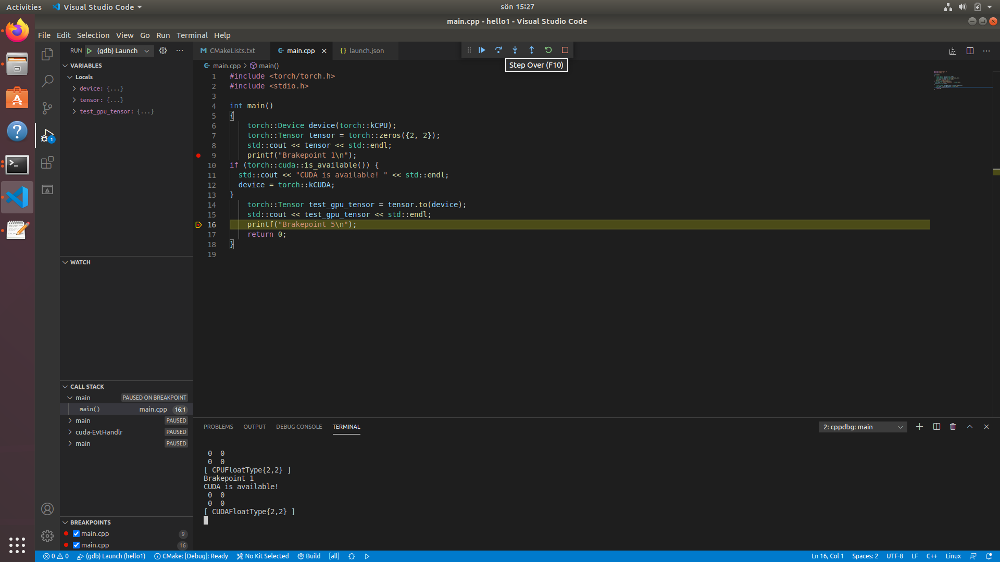
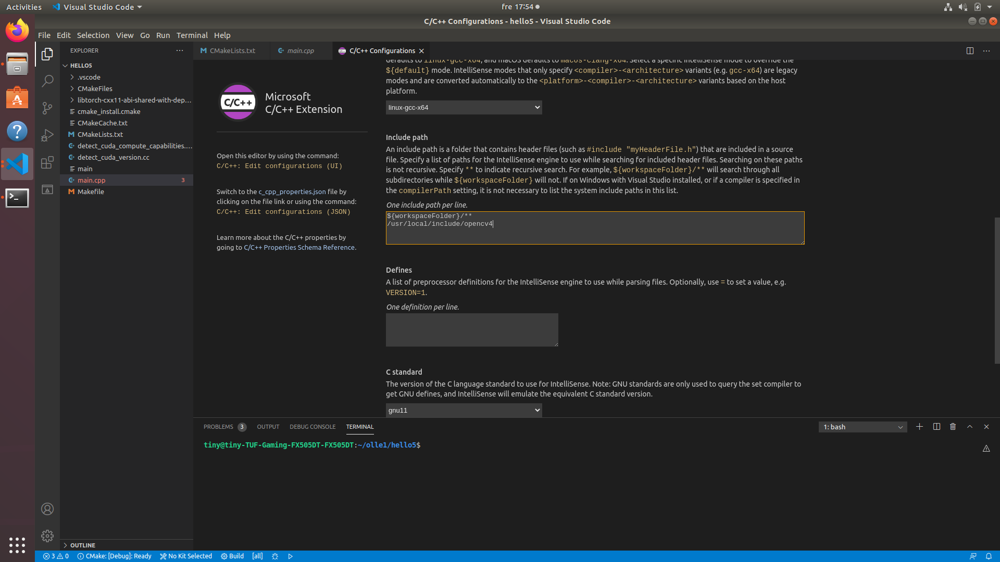

# Installing Ubuntu18.04, CUDA toolkit 10.1, cuDNN, Torchlib C++, cmake, VS code and OpenCV for machine learning.

### Install CUDA toolkit and cuDNN

https://medium.com/@stephengregory_69986/installing-cuda-10-1-on-ubuntu-20-04-e562a5e724a0#fa83

#### Modify the ~/.Profile file with extended path 10.1 and 10.2 
Start a terminal
    Ctrl-Alt-T
    
    $ sudo apt-get update
    $ sudo vim ~/.profile
    
Edit file and change
A convinent guide how to use vim editor:
https://coderwall.com/p/adv71w/basic-vim-commands-for-getting-started
    
    # set PATH for cuda 10.1 installation
    if [ -d "/usr/local/cuda-10.1/bin/" ]; then
        export PATH=/usr/local/cuda-10.1/bin${PATH:+:${PATH}}
        export LD_LIBRARY_PATH=/usr/local/cuda-10.1/lib64${LD_LIBRARY_PATH:+:${LD_LIBRARY_PATH}}
        export LD_LIBRARY_PATH=/usr/local/cuda-10.2/lib64${LD_LIBRARY_PATH:+:${LD_LIBRARY_PATH}}
    fi

#### reboot
    $ sudo reboot
    
### Check CUDA and cuDNN installation

#### Check Nvidia dirver
    $ nvidia-smi

Example answer:

    Tue Mar  2 19:19:42 2021       
    +-----------------------------------------------------------------------------+
    | NVIDIA-SMI 460.39       Driver Version: 460.39       CUDA Version: 11.2     |
    |-------------------------------+----------------------+----------------------+
    | GPU  Name        Persistence-M| Bus-Id        Disp.A | Volatile Uncorr. ECC |
    | Fan  Temp  Perf  Pwr:Usage/Cap|         Memory-Usage | GPU-Util  Compute M. |
    |                               |                      |               MIG M. |
    |===============================+======================+======================|
    |   0  GeForce GTX 1650    Off  | 00000000:01:00.0 Off |                  N/A |
    | N/A   42C    P8     3W /  N/A |      5MiB /  3911MiB |      0%      Default |
    |                               |                      |                  N/A |
    +-------------------------------+----------------------+----------------------+
                                                                                   
    +-----------------------------------------------------------------------------+
    | Processes:                                                                  |
    |  GPU   GI   CI        PID   Type   Process name                  GPU Memory |
    |        ID   ID                                                   Usage      |
    |=============================================================================|
    |    0   N/A  N/A      1510      G   /usr/lib/xorg/Xorg                  4MiB |
    +-----------------------------------------------------------------------------+

#### Check CUDA
    $ nvcc --version

Example answer:

    nvcc: NVIDIA (R) Cuda compiler driver
    Copyright (c) 2005-2019 NVIDIA Corporation
    Built on Sun_Jul_28_19:07:16_PDT_2019
    Cuda compilation tools, release 10.1, V10.1.243
    
#### Check cuDNN

    $ /sbin/ldconfig -N -v $(sed ‘s/:/ /’ <<< $LD_LIBRARY_PATH) 2>/dev/null | grep libcudnn

Example answer:

    sed: -e expression #1, char 1: unknown command: `�'
	libcudnn_adv_train.so.8 -> libcudnn_adv_train.so.8.0.4
	libcudnn_ops_train.so.8 -> libcudnn_ops_train.so.8.0.4
	libcudnn_cnn_train.so.8 -> libcudnn_cnn_train.so.8.0.4
	libcudnn_ops_infer.so.8 -> libcudnn_ops_infer.so.8.0.4
	libcudnn_adv_infer.so.8 -> libcudnn_adv_infer.so.8.0.4
	libcudnn_cnn_infer.so.8 -> libcudnn_cnn_infer.so.8.0.4
	libcudnn.so.7 -> libcudnn.so.7.6.5
	libcudnn.so.8 -> libcudnn.so.8.0.4
    
    
    
### Download libtorch
https://pytorch.org/

    PyTorch Build: Stable (1.7.1)
    Your OS: Linux
    Package: libtorch
    CUDA: 10.1
    
Download here (cxx11 ABI):      
https://download.pytorch.org/libtorch/cu101/libtorch-cxx11-abi-shared-with-deps-1.7.1%2Bcu101.zip

#### Make a test directory hello1
    $ mkdir hello1
    $ cd hello1
    /hello1$ wget https://download.pytorch.org/libtorch/cu101/libtorch-cxx11-abi-shared-with-deps-1.7.1%2Bcu101.zip
    
#### Unzip libtorch zipfile in hello1 directory
    /hello1$ unzip libtorch-cxx11-abi-shared-with-deps-1.7.1+cu101.zip

### Install cmake
    $ sudo apt-get update
    $ sudo apt-get install cmake
    
### Install git
	$ sudo apt-get update
	$ sudo apt-get install git

### Install OpenCV

	$ git clone https://github.com/opencv/opencv
	$ cd opencv

#### Make a build directory
    
    /opencv$ mkdir build
    /opencv$ cd build

#### Do cmake with OPENCV_GENERATE_PKGCONFIG=ON and with WITH_GTK=ON
Both OPENCV_GENERATE_PKGCONFIG=ON and WITH_GTK=ON need to be turned ON to not get error later.

    /opencv/build$ sudo cmake -D OPENCV_GENERATE_PKGCONFIG=ON WITH_GTK=ON ..
    /opencv/build$ sudo make

#### Time... for coffe :)
#### Put files into the system folder with this command:

    /opencv/build$ sudo make install
    
### Use Visual Studio Code IDE editor.

#### Install Visual Studio Code 
https://code.visualstudio.com/docs/setup/linux

    $ sudo snap install --classic code
    
#### Download test code, C++ main.cpp and CMakeFiles.txt (this repository).

	$ cd hello1
	/hello1$ git clone https://github.com/ollewelin/torchlib-opencv-gpu
	/hello1$ cd torchlib-opencv-gpu	
	/hello1/torchlib-opencv-gpu$ mv *.* ../
	/hello1/torchlib-opencv-gpu$ cd ..
	/hello1$ sudo rm -r torchlib-opencv-gpu
	
	
#### Start Visual Studio Code IDE with test files.

	/hello1$ code .

#### Include OpenCV path to VS code

	In VS code IDE:
	Wiev -> Command pallete.. -> C++: Edit Configurations (UI)
	add to Include path
	
	/usr/local/include/opencv4
##### Save settings
	CTRL-S

#### Important change CMakeLists.txt path with your working directory path
	/hello1$ cd ..
	/$ pwd
reply example 

	/home/tiny/olle1
	
Edit your path into CMakeLists.txt file
Example:

	...
	set(OpenCV_DIR /home/tiny/olle1/OpenCV/opencv-master/build)
	...
	list(APPEND CMAKE_PREFIX_PATH "/home/tiny/olle1/hello1/libtorch")
	...
	

#### Use cmake debug option
	
	/hello1$ cmake -DCMAKE_BUILD_TYPE=Debug .
	
#### Use cmake without debug option	
	/hello1$ cmake CMakeLists.txt
	
#### Compile and run test program

	/hello1$ make
	/hello1$ ./main

#### Run debug inside VS code
Edit launch.json file and change

	..
	"program": "enter program name, for example ${workspaceFolder}/a.out",
	..
to 

	..
	"program": "main",
	..
	
	
