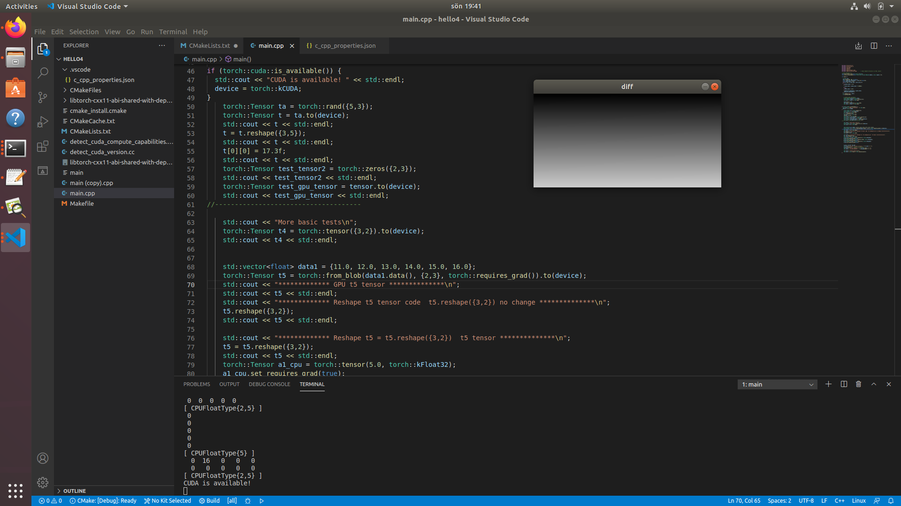

# Installing Ubuntu18.04, CUDA toolkit 10.1, cuDNN, Torchlib C++, cmake, VS code and OpenCV for machine learning.

### Install CUDA toolkit and cuDNN

https://medium.com/@stephengregory_69986/installing-cuda-10-1-on-ubuntu-20-04-e562a5e724a0#fa83

#### Modify the ~/.Profile file with extended path 10.1 and 10.2 
    
    # set PATH for cuda 10.1 installation
    if [ -d "/usr/local/cuda-10.1/bin/" ]; then
        export PATH=/usr/local/cuda-10.1/bin${PATH:+:${PATH}}
        export LD_LIBRARY_PATH=/usr/local/cuda-10.1/lib64${LD_LIBRARY_PATH:+:${LD_LIBRARY_PATH}}
        export LD_LIBRARY_PATH=/usr/local/cuda-10.2/lib64${LD_LIBRARY_PATH:+:${LD_LIBRARY_PATH}}
    fi

#### reboot
    $ sudo reboot
    
### Download libtorch
https://pytorch.org/

    PyTorch Build: Stable (1.7.1)
    Your OS: Linux
    Package: libtorch
    CUDA: 10.1
    
Download here (cxx11 ABI):      
https://download.pytorch.org/libtorch/cu101/libtorch-cxx11-abi-shared-with-deps-1.7.1%2Bcu101.zip

#### Make a test directory hello1
    /home/$ mkdir hello1
    /home/$ cd hello1
#### Unzip libtorch zipfile in hello1 directory
    $ /home/hello1
    
extract zip file result this:    
    
    $ /home/hello1/libtorch-cxx11-abi-shared-with-deps-1.7.1+cu101/libtorch

#### Install Visual Studio Code 
https://code.visualstudio.com/docs/setup/linux

    $ sudo snap install --classic code

### Install libgtk2.0-dev and pkg-config (Maybee not neccesary)
    $ sudo apt-get install libgtk2.0-dev
    $ sudo apt-get install pkg-config

### Install cmake
    $ sudo apt-get update
    $ sudo apt-get install cmake

### Install OpenCV

https://github.com/opencv/opencv

unzip opencv-master.zip

move to unziped folder directory 
examlpe

    $ cd /home/opencv-master

#### Make a build directory
    
    /home/opencv-master$ mkdir build
    /home/opencv-master$ cd build

#### Do cmake with OPENCV_GENERATE_PKGCONFIG=ON and with WITH_GTK=ON
Both OPENCV_GENERATE_PKGCONFIG=ON and WITH_GTK=ON need to be turned ON to not get error later.

    /home/opencv-master/build$ sudo cmake -D OPENCV_GENERATE_PKGCONFIG=ON WITH_GTK=ON ..
    /home/opencv-master/build$ sudo make

#### Time... for coffe :)
#### Put files into the system folder with this command:

    /home/opencv-master/build$ sudo make install
    
    

